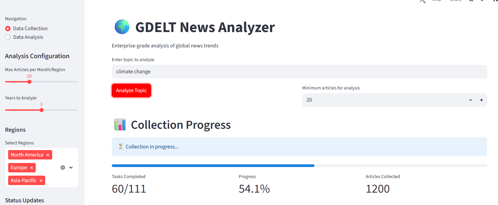
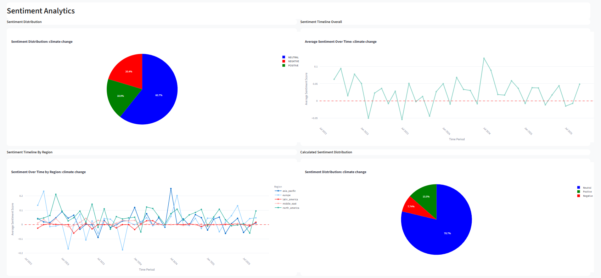
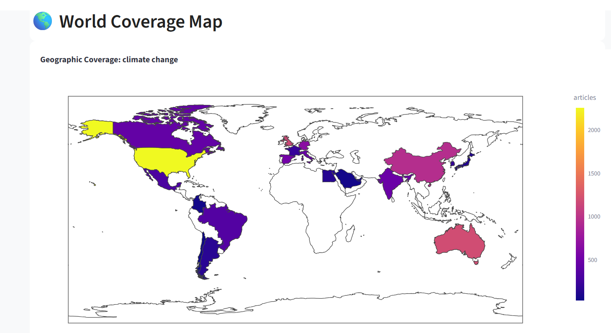

# GDELT Niche Tracker

A Streamlit-based analytics dashboard for exploring global news trends using the GDELT dataset.

## Features

- Collect news articles from GDELT by topic, region, and time period.
- Analyze and visualize news coverage, sentiment, sources, and more.
- Interactive dashboards with maps, time series, word clouds, and other visualizations.
- AWS Lambda and S3 integration for scalable data collection and storage.

## Project Structure

- `streamlit_app/` - Streamlit UI and analytics dashboard.
- `sagemaker/` - Analysis and visualization engines, data loaders.
- `lambda_function/` - AWS Lambda functions for orchestrating and processing data collection.
- `.env` - Environment variables for AWS and API keys.
- `requirements.txt` - Python dependencies.

## Setup

1. **Clone the repository:**
   ```
   git clone gdelt-niche-tracker
   cd gdelt-niche-tracker
   ```

2. **Install dependencies:**
   ```
   pip install -r requirements.txt
   ```

   > **Note:** If you want to use the word cloud feature, use Python 3.10 or 3.11.  
   > Python 3.13+ is not compatible with `wordcloud` as of now.

3. **Configure environment variables:**
   - Save your credentials in .env file
   ```
   AWS_ACCESS_KEY_ID=
   AWS_SECRET_ACCESS_KEY=
   AWS_S3_BUCKET=
   AWS_DEFAULT_REGION=
   AWS_ACCOUNT_ID=
   NEWS_LAMBDA_NAME=
   WORKER_LAMBDA_NAME=
   SQS_QUEUE_URL=
   ```

4. **Run the Streamlit app:**
   ```
   streamlit run streamlit_app/app.py
   ```

## Usage

- **Data Collection:**  
  Use the "Data Collection" page to collect news articles by topic, region, and time period.  
  Progress and status are shown in real time.

- **Data Analysis:**  
  Use the "Data Analysis" page to explore analytics and visualizations for any data present in your S3 bucket.

## AWS Integration

- Requires AWS credentials with access to S3, Lambda, and SQS.
- Lambda functions handle data collection and processing in the cloud.

## Troubleshooting

- If `wordcloud` fails to install, comment out or remove it from `requirements.txt` or use Python 3.10/3.11.
- Make sure your `.env` file is correctly configured for AWS and API access.
- For Streamlit Cloud, ensure all dependencies are listed in `requirements.txt`.

## Screenshots

Below are some example screenshots of the GDELT Niche Tracker dashboard:

**Data Collection Page**  


**Data Analysis Page**  


**World Coverage Map**  


---


## License

MIT License

---

**For more details, see the code and comments in each module.**
